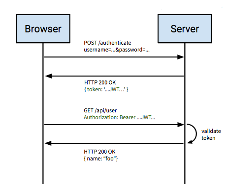
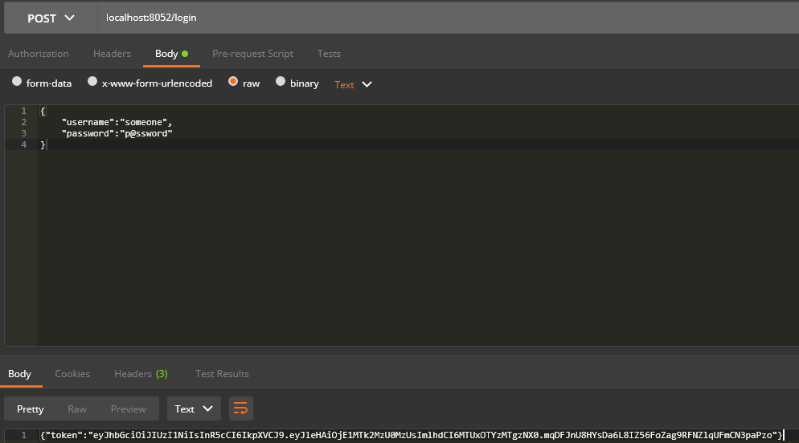
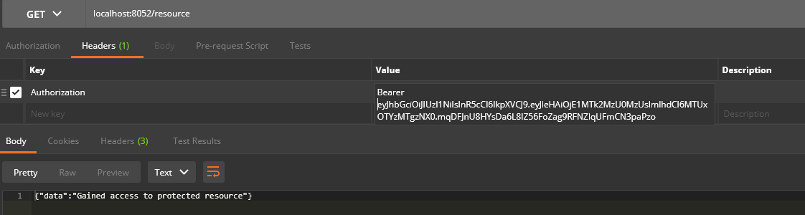

# golang-auth
首先，要搞明白一个问题，token、cookie、session的区别。

1. token、cookie、session的区别
- Cookie 
    Cookie总是保存在客户端中，按在客户端中的存储位置，可分为内存Cookie和硬盘Cookie。
    
    内存Cookie由浏览器维护，保存在内存中，浏览器关闭后就消失了，其存在时间是短暂的。硬盘Cookie保存在硬盘里，有一个过期时间，除非用户手工清理或到了过期时间，硬盘Cookie不会被删除，其存在时间是长期的。所以，按存在时间，可分为非持久Cookie和持久Cookie。
    
    cookie 是一个非常具体的东西，指的就是浏览器里面能永久存储的一种数据，仅仅是浏览器实现的一种数据存储功能。
    
    cookie由服务器生成，发送给浏览器，浏览器把cookie以key-value形式保存到某个目录下的文本文件内，下一次请求同一网站时会把该cookie发送给服务器。由于cookie是存在客户端上的，所以浏览器加入了一些限制确保cookie不会被恶意使用，同时不会占据太多磁盘空间，所以每个域的cookie数量是有限的。

- Session

    session 从字面上讲，就是会话。这个就类似于你和一个人交谈，你怎么知道当前和你交谈的是张三而不是李四呢？对方肯定有某种特征（长相等）表明他就是张三。
    
    session 也是类似的道理，服务器要知道当前发请求给自己的是谁。为了做这种区分，服务器就要给每个客户端分配不同的“身份标识”，然后客户端每次向服务器发请求的时候，都带上这个“身份标识”，服务器就知道这个请求来自于谁了。至于客户端怎么保存这个“身份标识”，可以有很多种方式，对于浏览器客户端，大家都默认采用 cookie 的方式。
    
    服务器使用session把用户的信息临时保存在了服务器上，用户离开网站后session会被销毁。这种用户信息存储方式相对cookie来说更安全，可是session有一个缺陷：如果web服务器做了负载均衡，那么下一个操作请求到了另一台服务器的时候session会丢失。

- Token 

    token的意思是“令牌”，是用户身份的验证方式，最简单的token组成:uid(用户唯一的身份标识)、time(当前时间的时间戳)、sign(签名，由token的前几位+盐以哈希算法压缩成一定长的十六进制字符串，可以防止恶意第三方拼接token请求服务器)。还可以把不变的参数也放进token，避免多次查库
    
    这里的token是指SON Web Token： 
    JSON Web Token (JWT) is a compact URL-safe means of representing claims to be transferred between two parties. The claims in a JWT are encoded as a JSON object that is digitally signed using JSON Web Signature (JWS).

- 使用JWT进行认证 

    JSON Web Tokens (JWT) are a more modern approach to authentication.
    
    As the web moves to a greater separation between the client and server, JWT provides a wonderful alternative to traditional cookie based authentication models.
    
    JWTs provide a way for clients to authenticate every request without having to maintain a session or repeatedly pass login credentials to the server.
    
    用户注册之后, 服务器生成一个 JWT token返回给浏览器, 浏览器向服务器请求数据时将 JWT token 发给服务器, 服务器用 signature 中定义的方式解码 
    JWT 获取用户信息.
    
    一个 JWT token包含3部分: 
    1. header: 告诉我们使用的算法和 token 类型 
    2. Payload: 必须使用 sub key 来指定用户 ID, 还可以包括其他信息比如 email, username 等. 
    3. Signature: 用来保证 JWT 的真实性. 可以使用不同算法 
    
    这里写图片描述
       
- JWT应用

    上面说了那么多，接下来就是要coding了。 
    
    用到的开源库： 
    
    github.com/codegangsta/negroni 
    
    Idiomatic HTTP Middleware for Golang 
    
    http的一个中间件
    
    github.com/dgrijalva/jwt-go 
    
    Golang implementation of JSON Web Tokens (JWT)
    
    github.com/dgrijalva/jwt-go/request
    
    这里分两个api，一个是通过login获取token，然后根据token访问另一个api。
    
2. 测试
- login
    
- resource  
      